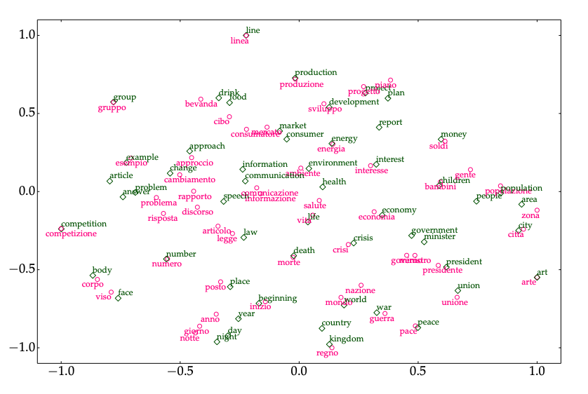

# PapersNotebook

Half a year has passed since I joined Okumura Lab, but still can't develop a focused research question. **A little of everything, nothing at all.** This repo is developed to help me dig more in the topic I'm interested with.:muscle:	

## Principles
1. Papers are roughly divided to two types: 
   * directly lead to my research topic
   * related algorithm (ML/DL)
2. 

## Catalogue

* [Subword-aligned Cross-lingual Word Embeddings](#subword-aligned-cross-lingual-word-embeddings)
  * [Cross-lingual Word Embeddings](#cross-lingual-word-embeddings)
  * [Monolingual Word Embeddings](#monolingual-word-embeddings)
  * [Subwords](#subwords)

## Subword-aligned Cross-lingual Word Embeddings

### Cross-lingual Word Embeddings

* [A Survey of Cross-lingual Word Embedding Models](https://arxiv.org/pdf/1706.04902.pdf)

#### Introduction

1. Cross-lingual Embeddings as Extensions: 
   - monoligual vector representations --> cross-lingual vector representations (in a joint embedding space) 
     
   - bilingual approaches --> multilingual setting

2. Data Requirements: 
   - alignment: word / sentence / document  
   - parallel / comparable ( about the same topic)
   
3. Obejective Functions 

4. Values:  
   - compare meaning of words across languages
   - mode transfer between languages (resource-rich --> low-resource, through common representation space), can also be evaluation.

#### [Monolingual Embedding Models](#monolingual-word-embeddings)

 
#### Cross-lingual Representations before Embeddings
#### Typology
#### Alignment
* Approaches
  * mapping-based
  * pseudo-bilingual corpora based
  * hybrid / joint 
* word

* [Unsupervised Cross-lingual Word Embeddings Based on Subword Alignment](http://www.tkl.iis.u-tokyo.ac.jp/new/uploads/publication_file/file/911/cicling2019.pdf)

Unluckily, it seems the idea of **using subword information in cross-lingual word embedding** has already been published by [Jin SAKUMA](http://www.tkl.iis.u-tokyo.ac.jp/~jsakuma/) of Yoshinaga Lab in U-Tokyo. **Need careful look to see what future work can be done while remain originality**.(2019/09/28)

* [Improving Cross-Lingual Word Embeddings by Meeting in the Middle](https://aclweb.org/anthology/D18-1027)

* [Unsupervised Cross-lingual Transfer of Word Embedding Spaces](https://aclweb.org/anthology/D18-1268)

### Monolingual Word Embeddings

* LSA: [Indexing by Latent Semantic Analysis](http://lsa.colorado.edu/papers/JASIS.lsi.90.pdf)  
1. factorize sparse word-word co-occurance matrix **C** --> dense word representations

2.elements(co-occurence counts) in **C** usually be replaced by the following for different purposes
  - TF-IDF (Term Frequency-Inverse Document Frequency):

    - weighting, more frequently a word in a documnet, more important; more docunments the word in, less important.     - no location/context information
  - PMI (pointwise mutual information):
  &space;=&space;log\frac{p(w_{i},w_{j})}{p(w_{i})p(w_{j})}=log\frac{count(w_{i},w_{j})count(corpus)}{count(w_{i}),count(w_{j})})
    - variant TF-IDF, biased by number of words itself (some high-frequency words like "the")
    - unobserved word, PMI = log0 = ∞, set to 0

* CBOW:
* SGNS: 
* GloVe: 

