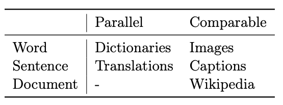

# PapersNotebook

Half a year has passed since I joined Okumura Lab, but still can't develop a focused research question. **A little of everything, nothing at all.** This repo is developed to help me dig more in the topic I'm interested with.:muscle:	

## Principles
1. Papers are roughly divided to two types: 
   * directly lead to my research topic
   * related algorithm (ML/DL)
2. Intensive reading of papers belonging to 2nd level (references by 1st level) are in /2nd, while anchored in this document.

## Catalogue

* [Subword-aligned Cross-lingual Word Embeddings](#subword-aligned-cross-lingual-word-embeddings)
  * [Cross-lingual Word Embeddings](#cross-lingual-word-embeddings)
  * [Monolingual Word Embeddings](#monolingual-word-embeddings)
  * [Subwords](#subwords)

## Subword-aligned Cross-lingual Word Embeddings

### Cross-lingual Word Embeddings

* [A Survey of Cross-lingual Word Embedding Models](https://arxiv.org/pdf/1706.04902.pdf)

#### Introduction

1. Cross-lingual Embeddings as Extensions: 
   - monoligual vector representations --> cross-lingual vector representations (in a joint embedding space) 
     
   - bilingual approaches --> multilingual setting

2. Data Requirements (choice of bilingual supervision signal): 
   - alignment (align a cross-lingual representation space): word / sentence / document  
   - parallel (exact translation) / comparable (about the same topic, only similar in some way)
   
   
3. Obejective Functions 

4. Values:  
   - compare meaning of words across languages, provide fine-grained word-level links between languages
   - mode transfer between languages (resource-rich --> low-resource, through common representation space), can also be evaluation.

#### [Monolingual Embedding Models](#monolingual-word-embeddings)

 
#### Cross-lingual Representations before Embeddings

- pre-date word embedding ideas
  - data: seed lexica / parallel data / document-aligned data
  - learning from limited bilingual supervision
  
- language-independent representations
  - rely on abstract linguistic labels, not lexical features (delexicalized cross-lingual and domain transfer)
  - rely on syntactic/POS contexts(2015) 
* [How to (Properly) Evaluate Cross-Lingual Word Embeddings:
On Strong Baselines, Comparative Analyses, and Some Misconceptions](https://www.aclweb.org/anthology/P19-1070)

#### Typology

> for final performance: choice of data \> underlying architecture
* after carefully chosen data, fine-grained optimized by architecture/hyper-parameters/fine-tuning
* [Cross-lingual Models of Word Embeddings: An Empirical Comparison](https://www.aclweb.org/anthology/P16-1157)

#### Alignment
* Approaches
  * mapping-based
  * pseudo-bilingual corpora based
  * hybrid / joint 
* word
  - parallel
    - using bilingual/cross-lingual dictionary
      -automatically align words in a parallel corpus -> produce bilingual dictionary
  - comparable
    - need other modalities: images
    
* sentence
  - parallel
    - Europarl corpus (parliament text)
  - comparable
    - captions of same images
    - different languages in similar images (not translations)

* document (comparable)
    - parallel requires translations, rare
    - topic-aligned: Wikipedia
    - class aligned: sentiment analysis / multi-class classification

* [Unsupervised Cross-lingual Word Embeddings Based on Subword Alignment](http://www.tkl.iis.u-tokyo.ac.jp/new/uploads/publication_file/file/911/cicling2019.pdf)

Unluckily, it seems the idea of **using subword information in cross-lingual word embedding** has already been published by [Jin SAKUMA](http://www.tkl.iis.u-tokyo.ac.jp/~jsakuma/) of Yoshinaga Lab in U-Tokyo. **Need careful look to see what future work can be done while remain originality**.(2019/09/28)

* [Improving Cross-Lingual Word Embeddings by Meeting in the Middle](https://aclweb.org/anthology/D18-1027)

* [Unsupervised Cross-lingual Transfer of Word Embedding Spaces](https://aclweb.org/anthology/D18-1268)

### Monolingual Word Embeddings

* LSA: [Indexing by Latent Semantic Analysis](http://lsa.colorado.edu/papers/JASIS.lsi.90.pdf)

> factorize sparse word-word co-occurance matrix **C** --> dense word representations  

1. elements(co-occurence counts) in **C** usually be replaced by the following for different purposes
    
   - TF-IDF (Term Frequency-Inverse Document Frequency):  
  
     - weighting, more frequently a word in a documnet, more important; more docunments the word in, less important.     
     - no location/context information
   - PMI (pointwise mutual information):  
  &space;=&space;log\frac{p(w_{i},w_{j})}{p(w_{i})p(w_{j})}=log\frac{count(w_{i},w_{j})count(corpus)}{count(w_{i}),count(w_{j})})  
     - variant TF-IDF, biased by number of words itself (some high-frequency words like "the")
     - unobserved word, PMI = log0 = ∞, set to 0
  
2. factorize PMI matrix **P** using SVD(Singular Value Decomposition)  
   - U, V column orthonormal, \psi diagonal singular  
    
   
   
3. reduce embedding matrix X to dimensionality k  
   - \psi-k: top k singular values, U-k: corresponding columns  
      
    

* MML(Max-margin loss): [A Unified Architecture for Natural Language Processing:
Deep Neural Networks with Multitask Learning](https://ronan.collobert.com/pub/matos/2008_nlp_icml.pdf)
  - vocabulary: list of words; corpus: set of texts 
  - may expand later (2019/09/29) 

* CBOW(Continuous bag-of-words):
> predict the center word  from all context words, n predict 1

* Skip-gram: 
> predict each context word from center word, 1 predict n
  - optimizations
    1. Hierarchical Softmax:
       - output layer: using haffman tree
    
    **2. Negative Sampling:** 
[Distributed Representations of Words and Phrases
and their Compositionality](./2nd/Distributed-Representations-of-Words-and-Phrases-and-their-Compositionality.md)
        

       * [Improving Distributional Similarity with Lessons Learned from Word Embeddings](https://www.aclweb.org/anthology/Q15-1016)

* GloVe: 

